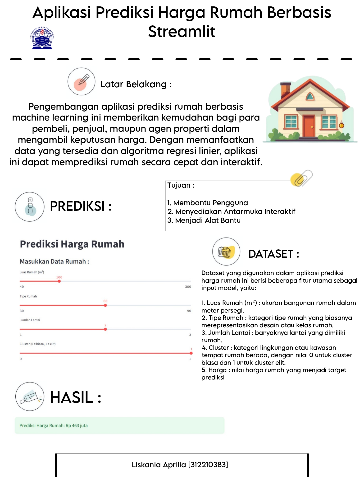

# 🏠 Prediksi Harga Rumah dengan Streamlit

Selamat datang di proyek Prediksi Harga Rumah!

Aplikasi ini dibangun menggunakan Python, Streamlit, dan scikit-learn untuk memudahkan pengguna dalam memperkirakan harga rumah berdasarkan berbagai fitur penting seperti luas bangunan, jumlah lantai, tipe rumah, dan status cluster elite.

# 📝 Deskripsi Singkat

Aplikasi ini cocok digunakan sebagai prototipe sistem estimasi harga properti berbasis data. Sangat bermanfaat untuk agen properti, pembeli rumah pertama, atau pengembang sistem valuasi rumah berbasis AI.

# 🚀 Fitur Utama
📊 Prediksi harga rumah secara real-time menggunakan regresi linear

🎛️ Antarmuka interaktif dengan slider dan dropdown untuk input pengguna

📈 Visualisasi hubungan antara variabel dan harga rumah

⚙️ Fleksibel untuk ditambahkan model atau fitur baru

# 🧠 Teknologi yang Digunakan

1. Streamlit – untuk membangun UI yang cepat dan interaktif

2. Pandas & NumPy – untuk manajemen data

3. scikit-learn – untuk pelatihan dan prediksi model

# 📦 Cara Menjalankan Aplikasi

```
streamlit run app.py
```

# 🎨 POSTER



# FINISH